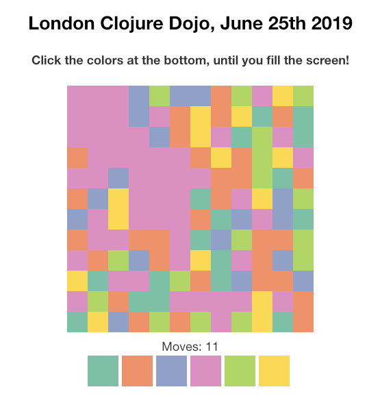

This is a "color game" made during the London Clojure Dojo meetup at ThoughtWorks.

You have a board filled with randomly colored cells.

Clicking colors at the bottom will fill the adjacent same color cells (starting from the top left corner) with the clicked color.

The goal is to fill the whole board with one color in a minimal number of moves.

**Hacking:**
* clone and cd to the repo
* `lein figwheel`
* hack!

[Live demo](http://www.ruslans.com/colorz)

